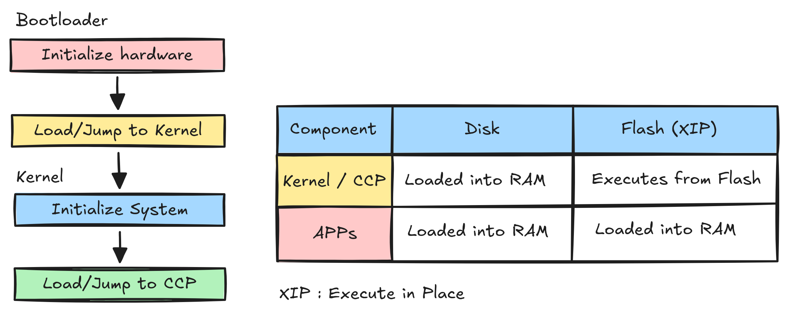

# Architecture

← [README](../README.md)

This page describes how CP/M Neo is laid out in memory, how it boots, and how its components are built.

## Layering & Memory Map


- The MMIO window base (`__io_base`) and the RAM base come from
  `platform/<name>/config.sh` (`IO_BASE`, `RAM_BASE`). The kernel is packed
  so it stays below `min(RAM_BASE + RAM_SIZE, IO_BASE)` and never touches the
  window.
- The TPA spans from `__tpa_base` (= `RAM_BASE + 0x100`) to the bottom of the
  kernel.

## Boot sequence



1. The bootloader sets up its stack and calls `bios_init()` **before any
   console output** — on real hardware output is impossible until the
   platform's peripherals are configured. If `bios_init()` fails, the
   bootloader halts silently (there is no console to report through).
2. It prints the banner, reads sector 0 into a scratch buffer, and verifies
   the `0xAA55` boot signature.
3. Reads the kernel load address and size from the sector-0 header (offsets
   in `core/kernel/disk_format.h`).
4. **Validates the kernel load range** before reading anything: the
   destination must start at or above the bootloader's runtime RAM
   (`__boot_stack_top`) and stay within usable RAM (`__ram_top`), so a corrupt
   sector-0 header cannot overwrite the bootloader or run past memory.
5. Loads the kernel sectors into RAM and verifies the kernel magic, then
   jumps to the kernel entry point.

## Kernel startup

`os_entry()` (core/kernel/main.c) runs `kernel_init()`:

- `disk_init()`: reads the volume map (VMAP) from sector 1.
- Binds the mounted volumes (A:.. up to `CONFIG_VOL_MAX`); the first mount becomes the default drive.

It then prints the TPA size and calls `kexec_ccp()`, which loads the CCP into
the TPA and jumps to it. When a user program calls `sys_exit()`, the kernel
reloads the CCP and restarts the command loop.

## Syscalls

System calls are plain kernel functions (`sys_open`, `sys_read`, …). User
programs and the CCP declare them in `<syscall.h>` and call them directly;
there is no jump table, trap, or `ecall`. The kernel exports each function's
address through `--just-symbols=kernel.elf` at link time, so a call site is a
direct jump (PC-relative or absolute) into the kernel's body. Because the
addresses are baked in at build time, programs and the kernel must be built
together — the `sysgen` workflow always rebuilds applications against the
current `kernel.elf`.

See [Syscall Reference](syscall-reference.md) for the full list.

## Shared stack

The kernel, the CCP, and user programs share a single stack at the boundary
between the TPA and the kernel (`__kernel_base`), reserving `__stack_size`
(4 KB). `__stack_size` and `__stack_top` are owned by the kernel linker
script and reach the CCP/apps via `--just-symbols`. Each program starts with
a fresh stack via `crt0.S` (`sp = _stack_top = __kernel_base`).

## Program entry and exit

A `.COM` binary is loaded at the TPA base (`__tpa_base`):

1. `arch/<isa>/crt0.S` sets the stack pointer and global pointer, copies
   `.data` from its load address (`_data_load`) to its runtime address
   (`_data_start`) and zeroes `.bss`, then jumps to `_start`. The same crt0
   is the entry point for the kernel, the CCP, and every user program.
2. `_start` (`sdk/src/start.c`) fetches arguments, calls `main(argc, argv)`,
   then calls `sys_exit()`, returning to the kernel which reloads the CCP.

### Hand-off: `kjump`

All three hand-offs (boot→kernel, kernel→CCP, kernel→`.com`) are unconditional
jumps into freshly prepared entry points. That step is `void kjump(uintptr_t
addr)` in `arch/<isa>/kjump.S` (`j a0` on RISC-V, `bx r0` on ARM). It is the
one ISA-specific transfer primitive in the kernel, because on ARM (Cortex-M)
the address must carry the Thumb bit (bit0 = 1) or the first branch faults.
`kjump` is a hard-required arch file — the build compiles the literal
`arch/$CONFIG_ARCH/kjump.S`, so a missing implementation fails the build.

## Execute-in-place (XIP)

CP/M Neo can run its kernel and CCP directly from storage instead of loading
them into RAM. XIP is an opt-in property of a disk image: the two image types
are structurally identical, differing only in the `S0_XIP` byte (sector 0,
offset `0x026`) and in which linker scripts were used.

### Enabling XIP

XIP is requested per build with `sysgen new --xip`. The window origin is
taken from `CONFIG_XIP_BASE` when the platform declares it; otherwise it is
auto-derived as `CONFIG_BOOT_BASE` + boot size (the window sits right past
the bootloader). Without `--xip` a build is always a plain non-XIP
(RAM-loaded) disk, and any `CONFIG_XIP_BASE` value is ignored. A platform
that needs the window somewhere other than right past boot declares it in
`config.sh`:

```sh
CONFIG_XIP_BASE=0x10000
```

There is no configured XIP window size: the window starts at `XIP_BASE` and
extends exactly over the XIP disk image — the kernel and CCP code live in the
disk's reserved sectors right past the boot and VMAP sectors;
`build_disk.sh` sizes the kernel's `XIP_REGION` at `__kernel_xip_base` and
`__kernel_xip_end` (the sector-aligned end of the kernel's in-place code,
defined by the kernel link itself), and the CCP is linked immediately after.
Whether the code fits the produced disk is validated by `sysgen`/`mkdisk` at
build time against the actual binary sizes. `build_disk.sh` stamps `IS_XIP=1`
into `sysgen/build/.xip`; `sysgen new` writes `S0_XIP=1` and prints `XIP: Yes`
in the build report. XIP requires a memory-mapped storage window; platforms
without one do not declare it.

### Who runs in place

Only the **kernel** and the **CCP** execute from flash. Every user `.com`
loads into the TPA and runs there, exactly as on a non-XIP disk.

The governing constraint is that an executable is *not* relocatable across an
arbitrary base: the linker resolves absolute data addresses, jump/data-table
addresses, and stored function pointers against one fixed origin. Running the
same bytes from any other base would dereference the wrong locations. In-place
execution is therefore only sound when a component sits at its **link origin**
(Δ = 0 between on-disk address and link address), which is guaranteed by
construction for exactly two components:

- **Kernel** — linked at `__kernel_xip_base = XIP_BASE + KERN_START_SEC*512`,
  the XIP address of the first byte of `kernel.bin` (past the bootloader and
  volume-map sectors), exactly where sysgen writes it. The bootloader jumps
  there directly.
- **CCP** — linked at `__kernel_xip_end`; the kernel link pads that symbol to
  a whole disk sector (`ALIGN(..., 512)`), and sysgen writes the CCP at the
  very next sector, so the on-disk address `XIP_BASE + (KERN_START_SEC +
  kernel_sectors)*512` equals the link origin.

User `.com` files occupy arbitrary, often fragmented data blocks, so no link
origin can match their on-disk placement; they are always RAM-loaded. For the
same reason there is no RAM "fallback" for XIP components — a fallback would
execute XIP-origin code from the wrong address. On an XIP disk the kernel
always jumps to the CCP at its in-place flash address, which sysgen guarantees
matches the CCP's link origin.

### Layout differences

| | Non-XIP (`vemu`) | XIP |
|---|---|---|
| kernel `.text` | RAM (`__KERN_START`) | XIP at `__kernel_xip_base = XIP_BASE + KERN_START_SEC*512` (past bootloader + volume-map) |
| CCP `.text` | RAM (TPA) | XIP at `__kernel_xip_end` |
| app `.text` | RAM (TPA) | RAM (TPA) |
| `.data` VMA | RAM | RAM |
| `.data` LMA | == VMA (no-op) | XIP, right after `.text` |
| `.bss` | RAM (NOLOAD) | RAM (NOLOAD) |
| `.data` copy in crt0 | self-copy no-op | XIP -> RAM |

The CCP starts at `__kernel_xip_end` (sector-aligned end of the kernel's
`.text` + `.data` image), so it never overlaps the kernel in the XIP region.

On boot, `S0_XIP` picks the path: non-XIP loads the kernel into RAM at
`S0_KERN_LOAD`; XIP skips the load and jumps to `XIP_BASE +
KERN_START_SEC*512` (the first byte of `kernel.bin`, equal to the kernel's
`_entry`). After each program exits, the kernel reloads the CCP to run it in
place from flash. Whether the kernel and CCP fit the produced disk is verified
at build time by `sysgen`/`mkdisk`, not by the linker.

### TPA sizing

The TPA — where user programs run and (on non-XIP) load — spans
`[__tpa_base, __kernel_base)`:

- `__tpa_base` is fixed at `CONFIG_RAM_BASE + 0x100`.
- `__kernel_base` (the TPA ceiling) is packed at the top of RAM:
  `__kernel_base = (RAM_TOP − __kernel_total) & ~3`, where `RAM_TOP` is
  `min(CONFIG_RAM_BASE + CONFIG_RAM_SIZE, CONFIG_IO_BASE)` and `__kernel_total`
  is the kernel's RAM footprint from the two-pass link.

Only `__kernel_total` differs between modes: non-XIP keeps `.text` in RAM
(the whole image); XIP counts only `.data` + `.bss`, so the kernel takes
less RAM and the TPA grows. The shared 4 KB stack sits at
`__stack_top = __kernel_base`, so usable program space is
`__kernel_base − __tpa_base − 4 KB`; `kexec` rejects larger files with
`E2BIG`.

### Why it is safe

CP/M Neo is single-task: only one program runs at a time, and nothing else
runs or writes the filesystem until it exits. An in-place program can't be
corrupted by later deletes/frees/reuse, so no block-pinning is needed.

## Building the OS

`sysgen new` runs `sysgen/build_disk.sh` with `--platform=<ID>`. The script
scans each `platform/*/config.sh` for a `CONFIG_ID=` equal to that argument to
find the platform's directory, then builds four components in order.

1. **Bootloader**: compiles the platform BIOS + `arch/<isa>/boot.S`, linked
   with `arch/<isa>/linker_boot.ld` into a `bootloader.bin`. Boot code is
   placed at `CONFIG_BOOT_BASE` (`__boot_base`, a platform constant); the
   boot code budget (`__boot_size`) and boot runtime RAM budget
   (`__boot_ram_size`) default to arch-owned values defined via `PROVIDE()`
   in the linker script, but a platform may override them by setting
   `CONFIG_BOOT_SIZE` / `CONFIG_BOOT_RAM_SIZE` in its `config.sh`. The
   boot runtime RAM (scratch + stack + bios `.bss`) occupies a separate
   `BRAM` region at `__ram_base + __boot_size`.
2. **Kernel**: a **two-pass link**:
   - Pass 1 links the kernel at a placeholder address to extract
     `__kernel_total` from the symbol table.
   - The real base `__KERN_START` is computed from
     `min(CONFIG_RAM_BASE + CONFIG_RAM_SIZE, CONFIG_IO_BASE) - __kernel_total`,
     then pass 2 re-links with it, producing `kernel.bin`. The platform's
     `CONFIG_IO_BASE`, `CONFIG_RAM_BASE`, and the derived `__tpa_base`/`__ram_top`
     are supplied to both passes via `--defsym=`.
3. **SDK libc**: the user-space library, archived to `libc.a`.
4. **CCP**: linked like a user program (below).

Each build writes the platform id — the `CONFIG_ID=` field of
`platform/<folder>/config.sh`, required and 8 chars max — into sector 0
(`S0_PLATFORM`, 8 bytes at offset `0x01E`); the build fails if `CONFIG_ID` is
unset or exceeds 8 characters. `build_disk.sh` also reads the four required
software knobs (`CONFIG_VOL_MAX`, `CONFIG_DISK_SIZE`, `CONFIG_FCB_MAX`,
`CONFIG_STACK_SIZE`) — every platform must declare them, there are no
defaults — and writes the effective values to `build/gen/config.h`, which
every kernel/CCP/SDK build includes.  The effective volume count and total
image size (`CONFIG_DISK_SIZE`, KB) are stamped as build tags (`.vol_max`,
`.disk_size_kb`) that `sysgen new` reads back to size and mount the image,
validated against the host ceilings in `sysgen/include/config.h` (16
volumes, 32 MB).  The platform's bundled-app selection is stamped the same
way (`.sys_apps` = the `CONFIG_SYS_APPS` value — `*` = all, `""` = none, a
list = those; `.extra_apps` = the `CONFIG_EXTRA_APPS` value); `sysgen new`
filters the installs against them, failing on a name with no matching source
so a typo can never silently drop an app.

### Linking against the kernel

The CCP and user apps are linked with `--just-symbols=kernel.elf` plus the SDK
linker script (`sdk/linker/linker_app.ld` for apps and the non-XIP CCP; the
XIP CCP uses `core/ccp/linker_ccp_xip.ld`). Both wrap the shared program layout
in `sdk/linker/linker_sdk.ld`. This lets them resolve kernel
symbols such as `sys_open`, `__kernel_base`, and `__tpa_base` without
embedding the kernel: the symbols resolve to whatever kernel is present at
runtime.

`sysgen install` uses the same mechanism via `sysgen/app_build.sh`.
